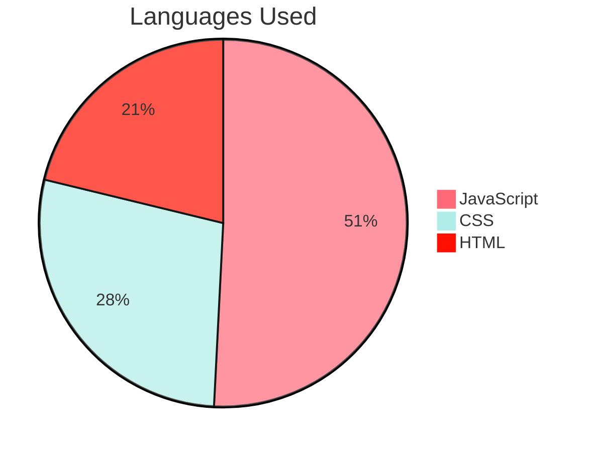

# Videos Recommandetion

Video Recomannedation is a React.js application which stores the videos in a database and enables user to delete a video, to rate as liked/disliked, to filter based on the popularity and to add various videos in the system.

## Deployed Website

Access the deployed version of the application: <a href='https://lorena-fullstack-app-yp9h.onrender.com/'>Videos Recommandetion</a>

## Inside The App


## Features

- [x] The user can see all the videos.
- [x] The user can access any video.
- [x] The user can delete a video.
- [x] The user can add a new video.
- [x] The user can asc/desc sort videos based on number of ratings.
- [x] The user can rate a video with like or dislike.


## Technologies Used:

- [ ] Node.js
- [ ] React.js
- [ ] CSS,
- [ ] PostgresSQL


## Pie Chart Of Languages Used



## Installation

**Clone the repository:**

```bash
git clone github.com/LorenaCapraru/tv-show-dom-project
```

**Install dependencies:**

```bash
npm install
```

**Start the development server:**

```bash
npm start
```
