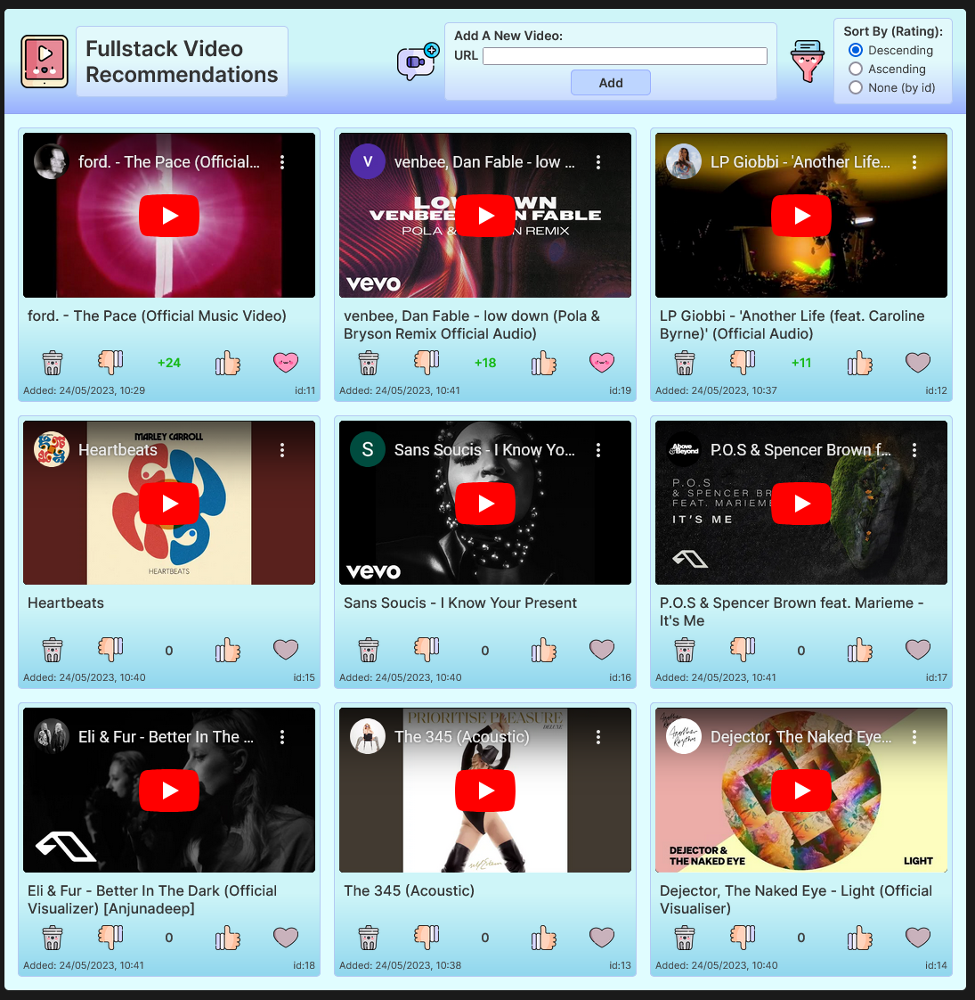

# FullStack Videos

## Project Screenshot:



## Description:

This is a Fullstack Video Recommendations application using:

React, JavaScript, HTML and CSS for the frontend client

and

Node, Express (API) with a PostgreSQL Database for the backend server

## Functionality

- Users can add videos from YouTube using the full URL, the title is automatically appended.

- Users can up vote or down vote individual videos.

- Users can favourite individual videos.

- Users can delete individual videos.

- Users can sort videos by votes descending (default), votes ascending, and by id number.

## Learning

This was a useful exercise in learning how to interact with a PostgreSQL database via a Node Express API.

Successful live deployment across multiple online providers was achieved.

For a result that a React Frontend, a Node Express API, and a PostgreSQL database all communicate correctly.

## Improvements

The application uses the database as it's single source of truth.

And therefore it takes time to make the request and response cycle before the User Interface updates.

It would be good to implement context so there is a direct tie between frontend state and backend state.

This would remove any visual delay or responsiveness compromise.

Currently the VideoPage is controlled by a workaround state, this should be converted into Context.

---

## Project Setup:

1. clone the repo `git clone https://github.com/bazmurphy/fullstack-videos`

## Server:

1. `cd server`
2. `npm install`
3. copy the `.env.sample` as `.env`
4. add the Database Connection variables
5. `npm run start`

## Client:

1. `cd client`
2. `npm install`
3. copy the `.env.sample` as `.env`
4. add the API URL variable
5. `npm run start`

---

## Database Setup:

### Local:

1.  Create a local database: `createdb fullstack_videos`
2.  Connect to the local database: `psql fullstack_videos`
3.  Populate the Database: `\i videos.sql`
4.  Add ENV variables to the local `.env` file

```
DB_HOST=localhost
DB_PORT=5432
DB_NAME=fullstack_videos
DB_USER={your database username}
DB_PASS={your database password}
```

### Online:

1.  Make a PostgreSQL database on Render
2.  Connect to PostgreSQL database on Render via the terminal:
    `psql -h {hostname}.{region}-postgres.render.com -U {your_username} {your database name}`
3.  Enter password:
    `{your_password}`
4.  Populate the Database:
    `\i fullstackprojectassessment.sql`
5.  Add ENV variables to the Render API settings

```
DB_HOST : {hostname}.{region}-postgres.render.com
DB_PORT : 5432
DB_NAME : {your Render database name}
DB_USER : {your Render database username}
DB_PASS : {your Render database password}
```
